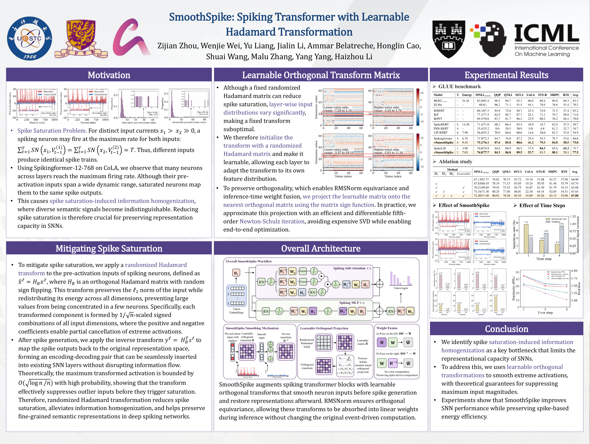

<div align="center">

<h1>SmoothSpike: Spiking Transformer with Learnable Hadamard Transformation</h1>

<p>
  <a href="https://proceedings.mlr.press/v306/zhou26ax.html"></a>
  <a href="https://raw.githubusercontent.com/mlresearch/v306/main/assets/zhou26ax/zhou26ax.pdf"></a>
  <a href="assets/SmoothSpike_ICML2026_poster.pdf"></a>
  <a href="https://modelscope.cn/models/kailai1104/SmoothSpike"></a>
</p>

<p>
  Zijian Zhou, Wenjie Wei<sup>&dagger;</sup>, Yu Liang, Jialin Li, Ammar Belatreche,<br>
  Honglin Cao, Shuai Wang, Malu Zhang, Yang Yang, Haizhou Li
</p>

<p><sup>&dagger;</sup> Corresponding author</p>
<p>Official implementation of SmoothSpike, published at <strong>ICML 2026</strong>.</p>

</div>

## News

- 🎉 **ICML 2026:** SmoothSpike has been accepted to the 43rd International Conference on Machine Learning. [Paper](https://proceedings.mlr.press/v306/zhou26ax.html)
- 🚀 **Code & checkpoint:** The implementation and [pretrained SmoothSpike BERT checkpoint](https://modelscope.cn/models/kailai1104/SmoothSpike) are available.

## Overview

**SmoothSpike** addresses **spike saturation-induced information homogenization** in spiking Transformers. Within a time window of `T` steps, a neuron can emit at most `T` spikes. Distinct high-amplitude inputs can therefore collapse to the same spike count, erasing fine-grained semantic differences.

We smooth the pre-activation inputs of spiking neurons with learnable orthogonal transformations:

- **Energy-preserving smoothing.** Randomized Hadamard transforms redistribute input energy across channels while preserving the input's L2 norm, reducing extreme activations and spike saturation.
- **Learnable orthogonal transforms.** Hadamard-initialized matrices adapt to layer-specific input distributions through differentiable Newton-Schulz iterations.
- **Inference-time weight fusion.** Orthogonal transforms can be absorbed into neighboring linear weights, preserving spike-driven computation. See [Weight Fusion](#weight-fusion) for the released implementation.

> SmoothSpike improves the Spikingformer GLUE average from **66.8 to 75.0 (+8.2 points)** and the SpikeLM average from **75.7 to 77.5 (+1.8 points)**.

[](assets/SmoothSpike_ICML2026_poster.pdf)

<p align="center"><em>Click the poster to open the full-resolution PDF.</em></p>

## Main Results on GLUE

Results on the **GLUE development set**, reproduced from Table 1 of the [paper](https://proceedings.mlr.press/v306/zhou26ax.html). `T` denotes time steps; MNLI reports matched/mismatched scores. Energy is the paper's estimate in mJ; `-` denotes an unreported value.

| Model | T | Energy (mJ) | MNLI-m/mm | QQP | QNLI | SST-2 | CoLA | STS-B | MRPC | RTE | Avg. |
| :--- | :---: | :---: | :---: | :---: | :---: | :---: | :---: | :---: | :---: | :---: | :---: |
| BERT-base | - | 51.41 | 83.8/83.4 | 90.5 | 90.7 | 92.3 | 60.0 | 89.4 | 89.8 | 69.3 | 83.2 |
| ELMo | - | - | 68.6/- | 86.2 | 71.1 | 91.5 | 44.1 | 70.4 | 76.6 | 53.4 | 70.2 |
| BiBERT | - | - | 66.1/67.5 | 84.8 | 72.6 | 88.7 | 25.4 | 33.6 | 72.5 | 57.4 | 63.2 |
| BiT | - | - | 77.1/77.5 | 82.9 | 85.7 | 87.7 | 25.1 | 71.1 | 79.7 | 58.8 | 71.0 |
| BiPFT | - | - | 69.5/70.6 | 83.7 | 81.7 | 86.2 | 22.9 | 80.2 | 76.2 | 66.1 | 70.8 |
| SpikeBERT | 4 | 14.30 | 71.4/71.0 | 68.2 | 66.4 | 85.4 | 16.9 | 18.7 | 82.0 | 57.5 | 59.7 |
| PSN-BERT | 4 | - | 35.4/35.2 | 0.0 | 50.5 | 50.9 | 0.0 | 6.8 | 81.2 | 52.7 | 34.7 |
| LIF-BERT | 4 | 7.98 | 56.8/55.2 | 70.0 | 60.6 | 80.6 | 14.6 | 20.0 | 82.3 | 53.8 | 54.9 |
| Spikingformer | 4 | 6.76 | 71.9/72.5 | 84.7 | 76.0 | 87.2 | 24.4 | 54.5 | 79.7 | 55.6 | 66.8 |
| **Spikingformer + SmoothSpike** | **4** | **9.45** | **75.1/76.1** | **87.6** | **83.8** | **88.6** | **41.2** | **79.3** | **84.8** | **58.5** | **75.0** |
| SpikeLM | 1 | 3.98 | 76.0/76.9 | 84.0 | 84.9 | 86.5 | 37.9 | 84.3 | 85.6 | 65.3 | 75.7 |
| **SpikeLM + SmoothSpike** | **1** | **7.03** | **76.8/77.7** | **84.3** | **86.8** | **89.5** | **52.7** | **83.5** | **88.1** | **58.1** | **77.5** |

On Spikingformer, the largest gains are **+24.8 on STS-B**, **+16.8 on CoLA**, and **+7.8 on QNLI**. The estimated energy can change with spike activity; removing explicit transform operations does not imply unchanged total energy relative to the vanilla baseline.

### Ablation Study

GLUE average scores for a **4-layer Spikingformer with hidden size 768** (Table 2 of the paper).

| Configuration | H1 | H2 | H3 | Learnable | GLUE Avg. |
| :--- | :---: | :---: | :---: | :---: | :---: |
| Baseline | - | - | - | - | 64.00 |
| Fixed randomized Hadamard | ✓ | - | - | - | 63.74 |
| Learnable H1 | ✓ | - | - | ✓ | 65.88 |
| Learnable H1 + H2 | ✓ | ✓ | - | ✓ | 67.64 |
| **Learnable H1 + H2 + H3** | **✓** | **✓** | **✓** | **✓** | **67.88** |

Making `H1` learnable improves the average by **2.14 points** over its fixed counterpart. Combining all three learnable transforms yields **+3.88 points** over the 4-layer baseline.

## Quick Start

### Requirements

- Python 3.9 or newer.
- PyTorch 2.0 or newer with a compatible CUDA build from [pytorch.org](https://pytorch.org/get-started/locally/).
- `transformers>=4.57.0`, `datasets>=2.14.0`, Accelerate, SpikingJelly, and the remaining packages in [requirements.txt](requirements.txt).
- A CUDA toolkit for building [fast-hadamard-transform](https://github.com/Dao-AILab/fast-hadamard-transform). The requirements file uses `cupy-cuda12x`; choose the CuPy package matching your CUDA environment if needed.

```bash
git clone https://github.com/CayleyZ/SmoothSpike.git
cd SmoothSpike
pip install -r requirements.txt

git clone https://github.com/Dao-AILab/fast-hadamard-transform.git
pip install ./fast-hadamard-transform
```

Run the following commands from the SmoothSpike repository root. Shell examples use Bash syntax.

### Pretrained Weights

| Checkpoint | Architecture | T | Download |
| :--- | :---: | :---: | :---: |
| SmoothSpike BERT (unfused) | 12 layers, hidden size 768 | 4 | [ModelScope](https://modelscope.cn/models/kailai1104/SmoothSpike) |
| SmoothSpike BERT (fused) | 12 layers, hidden size 768 | 4 | Generate locally with [convertor.py](convertor.py) |

Download the pretrained weights and copy the bundled configuration/tokenizer files into the checkpoint directory:

```bash
pip install modelscope
modelscope download \
  --model kailai1104/SmoothSpike \
  checkpoints/smoothspike-bert-base/model.safetensors \
  --local_dir .

cp tokenizer_files/* checkpoints/smoothspike-bert-base/
```

The local directory should contain `model.safetensors`, `config.json`, `tokenizer.json`, `tokenizer_config.json`, `special_tokens_map.json`, and `vocab.txt`. Only the **unfused** pretrained weights are hosted on ModelScope.

### Finetuning on GLUE

The script downloads the selected task through `load_dataset("nyu-mll/glue", task_name)`. For example, finetune on SST-2:

```bash
python finetune_spiking_rot.py \
  --task_name sst2 \
  --model_name_or_path tokenizer_files \
  --pretrained_checkpoint checkpoints/smoothspike-bert-base \
  --T 4 \
  --per_device_train_batch_size 32 \
  --per_device_eval_batch_size 32 \
  --learning_rate 2e-5 \
  --num_train_epochs 3 \
  --output_dir outputs/sst2
```

Use `--pretrained_checkpoint` to select the custom SmoothSpike model loader. `--model_name_or_path tokenizer_files` supplies its configuration and tokenizer; the classification head is initialized for the selected task.

The paper's eight tasks are `mnli`, `qqp`, `qnli`, `sst2`, `cola`, `stsb`, `mrpc`, and `rte`. This command is a usage example; paper reproduction also requires the task-specific settings in the appendix. The current script logs classification accuracy and STS-B mean squared error. To compare CoLA, STS-B, and other multi-metric tasks with the paper, use the corresponding GLUE metrics.

### Weight Fusion

Generate a fused checkpoint for inference:

```bash
python convertor.py \
  --input checkpoints/smoothspike-bert-base \
  --output checkpoints/smoothspike-bert-base-fused \
  --config tokenizer_files
```

For the released 12-layer checkpoint, the expected summary is:

```text
Saved fused weights to checkpoints/smoothspike-bert-base-fused/model.safetensors
Saved fusion report to checkpoints/smoothspike-bert-base-fused/fusion_report.json
Removed 24 keys
Kept bert.H1: True
Remaining per-layer H2/H3 keys: 0
```

The converter folds **per-layer `H2` and `H3`** into adjacent linear weights and removes their parameters. The released inference model retains **global `bert.H1`** for the embedding-side transform and final encoder-output inverse transform.

Load the fused weights with the matching inference model:

```python
from transformers import BertConfig
from spikingbert_rot_inf import BertForMaskedLM

config = BertConfig.from_pretrained("tokenizer_files", local_files_only=True)
config.T = 4
config._attn_implementation = "eager"

model = BertForMaskedLM.from_pretrained(
    "checkpoints/smoothspike-bert-base-fused",
    config=config,
    local_files_only=True,
)
model.eval()
```

**Match the checkpoint to the model:** use `spikingbert_rot.py` for unfused weights and `spikingbert_rot_inf.py` for fused weights. The two formats are not interchangeable. The tied `cls.predictions.decoder.*` tensors may be absent from raw safetensors metadata; `from_pretrained` restores the weight tying.

### Pretraining Data

The pretraining run used **STORIES, BookCorpus, CC-News, OpenWebText, and Wikipedia**. Prepare local Hugging Face datasets and a tokenized `DatasetDict` with `train` and `validation` splits:

```text
data/
├── raw/
│   ├── STORIES/
│   ├── bookcorpus/
│   ├── cc_news/
│   ├── openwebtext/
│   └── wikipedia/
└── 128_tokenized_data/
    ├── train/
    └── validation/
```

Training reads the processed cache with `load_from_disk(args.tokenized_dataset_path)`. The script's tokenization/chunking block is currently commented out, and `--dataset_name` still loads the raw local datasets, so **both the raw paths and the processed cache must exist**. These datasets and the cache are not bundled with the repository.

Each cached example is a 128-token block with `input_ids`, `token_type_ids`, `attention_mask`, and `special_tokens_mask`. MLM labels are generated dynamically with `DataCollatorForLanguageModeling` at the default masking probability of `0.15`.

<details>
<summary><strong>Dataset cache details and regeneration</strong></summary>

The original processed cache contained **137,271,688 training examples** and **1,627,657 validation examples**. Its fields were `input_ids: int32`, `token_type_ids: int8`, `attention_mask: int8`, and `special_tokens_mask: int8`, each of length 128.

The original local raw datasets had these sizes:

| Dataset | Train | Validation | Test |
| :--- | ---: | ---: | ---: |
| STORIES | 945,354 | 946 | 947 |
| BookCorpus | 74,004,228 | - | - |
| CC-News | 708,241 | - | - |
| OpenWebText | 20,610 | - | - |
| Wikipedia | 6,407,814 | - | - |

These counts describe the original local copies, rather than canonical dataset sizes. The existing loader uses the first `min(1000, len(train))` rows as validation when no validation split exists; those rows remain in the training split. The following example mirrors that preprocessing convention. For independent evaluation, hold out validation rows from training before tokenization.

```python
from itertools import chain
from datasets import DatasetDict, concatenate_datasets, load_from_disk
from transformers import AutoTokenizer

raw_paths = [
    "data/raw/STORIES",
    "data/raw/bookcorpus",
    "data/raw/cc_news",
    "data/raw/openwebtext",
    "data/raw/wikipedia",
]
tokenizer = AutoTokenizer.from_pretrained("tokenizer_files", local_files_only=True)
max_seq_length = 128
all_datasets = [load_from_disk(path) for path in raw_paths]
raw_datasets = DatasetDict({
    "train": concatenate_datasets([d["train"] for d in all_datasets]),
    "validation": concatenate_datasets([
        d["validation"] if "validation" in d
        else d["train"].select(range(min(1000, len(d["train"]))))
        for d in all_datasets
    ]),
})
column_names = raw_datasets["train"].column_names
text_column_name = "text" if "text" in column_names else column_names[0]

def tokenize_function(examples):
    return tokenizer(examples[text_column_name], return_special_tokens_mask=True)

def group_texts(examples):
    concatenated = {k: list(chain(*examples[k])) for k in examples}
    total_length = len(concatenated[list(examples.keys())[0]])
    total_length = (total_length // max_seq_length) * max_seq_length
    return {
        k: [t[i : i + max_seq_length] for i in range(0, total_length, max_seq_length)]
        for k, t in concatenated.items()
    }

tokenized = raw_datasets.map(
    tokenize_function,
    batched=True,
    num_proc=32,
    remove_columns=column_names,
    desc="Running tokenizer on every text",
)
tokenized = tokenized.map(
    group_texts,
    batched=True,
    num_proc=32,
    desc="Grouping texts in chunks of 128",
)
tokenized.save_to_disk("data/128_tokenized_data")
```

</details>

### Pretraining

The original run used **8 GPUs**, a per-device batch size of **64**, and gradient accumulation of **1**, giving an effective batch size of **512**. After preparing the datasets above, launch with Accelerate:

```bash
accelerate launch --multi_gpu --num_processes 8 spiking_pretrain_rot.py \
  --dataset_name data/raw/STORIES \
                 data/raw/bookcorpus \
                 data/raw/cc_news \
                 data/raw/openwebtext \
                 data/raw/wikipedia \
  --model_name_or_path bert-base-uncased \
  --T 4 \
  --per_device_train_batch_size 64 \
  --per_device_eval_batch_size 64 \
  --learning_rate 2e-4 \
  --max_train_steps 800000 \
  --num_warmup_steps 5000 \
  --output_dir checkpoints/smoothspike-bert-base \
  --max_seq_length 128 \
  --tokenized_dataset_path data/128_tokenized_data \
  --checkpointing_steps 50000 \
  --preprocessing_num_workers 32 \
  --with_tracking \
  --report_to wandb
```

Here `--model_name_or_path` supplies the BERT configuration and tokenizer; the script initializes the SmoothSpike MLM model from scratch. Configure your W&B account for this example, or omit `--with_tracking` and `--report_to wandb` to run without tracking.

## Repository Contents

| Path | Description |
| :--- | :--- |
| [spikingbert_rot.py](spikingbert_rot.py) | SmoothSpike BERT with explicit learnable transforms for training and unfused checkpoints. |
| [spikingbert_rot_inf.py](spikingbert_rot_inf.py) | Inference model for checkpoints with fused per-layer transforms. |
| [convertor.py](convertor.py) | Weight fusion and conversion report generation. |
| [spiking_pretrain_rot.py](spiking_pretrain_rot.py) | Masked-language-model pretraining. |
| [finetune_spiking_rot.py](finetune_spiking_rot.py) | GLUE task finetuning with the custom checkpoint loader. |
| [hadamard_utils.py](hadamard_utils.py), [utils.py](utils.py) | Hadamard transforms and model utilities. |
| [tokenizer_files/](tokenizer_files/) | Bundled BERT configuration and tokenizer files. |
| [assets/](assets/) | ICML 2026 poster PDF and README preview. |

Downloaded weights live in `checkpoints/smoothspike-bert-base/`; fused weights are generated in `checkpoints/smoothspike-bert-base-fused/`.

<details>
<summary><strong>Transform placement</strong></summary>

- `H1` is shared across residual-connected branches to align representation spaces.
- `H2` transforms the value projection branch.
- `H3` is a block-diagonal MLP transform with four equally sized blocks.
- Query/key LIF neurons remain untransformed because they exhibit milder saturation empirically.

SmoothSpike uses a pre-norm architecture with RMSNorm. Absorbing the RMSNorm scale into spiking thresholds yields scale-free, orthogonally equivariant normalization, enabling the weight-fusion construction described in the paper.

</details>

## Citation

If you find SmoothSpike useful in your research, please cite our paper:

```bibtex
@inproceedings{pmlr-v306-zhou26ax,
  title     = {{SmoothSpike}: Spiking Transformer with Learnable Hadamard Transformation},
  author    = {Zhou, Zijian and Wei, Wenjie and Liang, Yu and Li, Jialin and Belatreche, Ammar and Cao, Honglin and Wang, Shuai and Zhang, Malu and Yang, Yang and Li, Haizhou},
  booktitle = {Proceedings of the 43rd International Conference on Machine Learning},
  pages     = {165991--166008},
  year      = {2026},
  volume    = {306},
  series    = {Proceedings of Machine Learning Research},
  publisher = {PMLR},
  url       = {https://proceedings.mlr.press/v306/zhou26ax.html}
}
```
